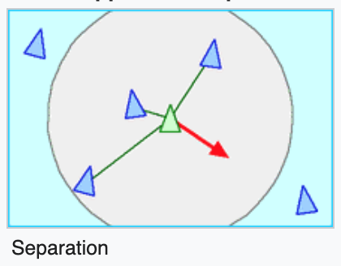
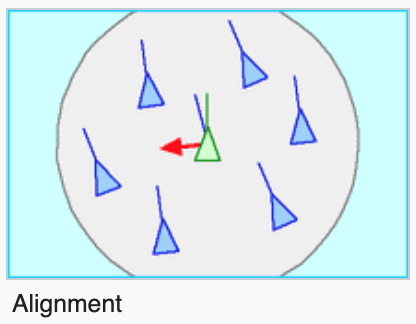
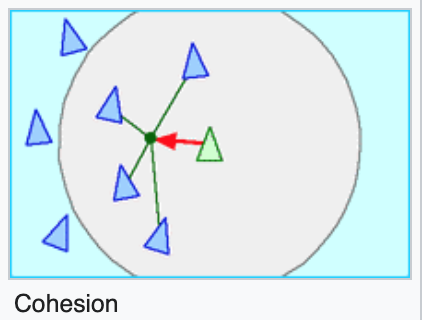

# Boid Flocking Simulation

### A flocking simulation made with the Boid algorithm

The boid algorithm consists of 3 rules:

|asdf|asfd|
|asdf|asdf|
|asdf|asdf|

 
  
l;asjdlfj

 
  
asdfasdf

 
  
asdfasdf

